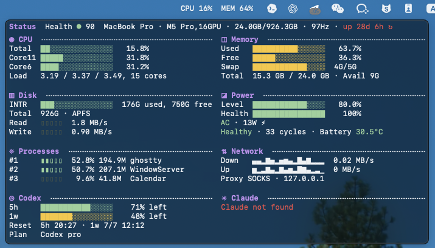

# Lutop

Lutop is a lightweight macOS menu bar resource monitor with a Mole-style compact terminal dashboard. It shows CPU, memory, disk, power, processes, network, local Codex / Claude Code quota information, and date reminders in a dense two-column panel.

It is designed to stay small: no Dock icon, no package installer, no background helper daemon, no usage cache, and no telemetry.

## Preview



## Features

- Menu bar CPU / memory summary.
- Click-to-open compact resource panel.
- Mole-style two-column text dashboard with compact section symbols.
- CPU load, hottest cores, load average.
- Memory used/free/swap.
- Startup disk usage and disk read/write rates.
- Battery level, health, cycle count, temperature, and power state.
- Top processes by CPU.
- Network up/down rates and proxy status.
- Codex quota from local `~/.codex/sessions/**/*.jsonl` `rate_limits`.
- Claude Code quota through an optional local status line bridge.
- Local one-time, weekly, monthly, and yearly date reminders with urgency colors.
- Optional Keep Awake toggle backed by a Lutop-managed `caffeinate -dimsu` process.
- Optional Start at Login via a per-user LaunchAgent.

## Build And Run

```sh
make run
```

The app hides its Dock icon and stays in the system menu bar. Click the status item to open the panel. Right-click the status item for Start at Login, Keep Awake, date reminders, `Update Code Usage`, and Claude Code disconnect controls.

## Date Reminders

The bottom dashboard places Codex and Claude Code usage on the left and date reminders on the right. Reminder rows are ordered by urgency:

- due or overdue reminders are red,
- reminders inside their configured warning period are yellow,
- later reminders use the normal text color.

Use the right-click `Date Reminders` submenu to add, complete, edit, or delete reminders. Add and Edit use a compact form rather than a separate management window. Each reminder can repeat once, weekly, monthly, or yearly and can warn 1, 3, 7, 14, or 30 days in advance.

Completing a one-time reminder deletes it. Completing a recurring reminder advances it to the first future occurrence. Reminders are stored locally at `~/Library/Application Support/Lutop/reminders.json` and are never uploaded.

## Build App Bundle

```sh
make bundle
open dist/Lutop.app
```

`dist/Lutop.app` is a development build artifact, not the formal install location.

## Install

```sh
make install
```

This builds a release bundle, copies it to `~/Applications/Lutop.app`, ad-hoc signs it, and starts the installed app. Start at Login always points to `~/Applications/Lutop.app`.

## Uninstall

```sh
make uninstall
```

This quits Lutop, restores any Lutop-owned Claude Code status line bridge, removes `~/Applications/Lutop.app`, removes `~/Library/LaunchAgents/dev.yiminglu.lutop.login.plist`, and removes `~/Library/Application Support/Lutop`.

Lutop does not create a pkg receipt, cache folder, preferences file, usage cache, or runtime temp files. Its only Application Support data is the reminder JSON file. Development files such as `.build` and `dist` are managed by `make clean`.

## Debug Snapshot

```sh
make snapshot
```

This prints the same dashboard text used by the popover and exits.

## Tests

```sh
make test
```

The test wrapper supplies the Swift Testing framework paths required by Command Line Tools-only installations.

## Codex Quota

Lutop scans recent local Codex session JSONL files under `~/.codex/sessions` and uses the latest real subscription quota bucket:

- `limit_id == "codex"`
- `primary.window_minutes == 300` for `5h`
- `secondary.window_minutes == 10080` for `1w`

The panel displays remaining quota, not total token usage or API cost.

Use the right-click menu item `Update Code Usage` to immediately rescan local Codex session quota without waiting for the normal background refresh interval.

## Claude Code Quota

Claude Code quota is optional. Use the right-click menu item `Update Code Usage` to install or refresh the local status line bridge when `~/.claude` exists.

The bridge:

- reads Claude Code status line JSON from stdin,
- extracts `rate_limits.five_hour` and `rate_limits.seven_day`,
- sends the data to the running Lutop app through a local distributed notification,
- preserves and restores the user's original Claude Code status line when disconnected.

Claude Code quota is only updated after Claude Code emits its next status line JSON. If `~/.claude` is not present, Lutop only updates Codex usage and does not create or modify Claude Code configuration.

## Privacy

Lutop reads local system APIs, local quota files, and its local reminder file only. It does not upload data, does not write usage history, and does not create a cache for quota data.

## Reference Projects

Lutop's compact two-column dashboard style, section text symbols, separator rhythm, color treatment, and terminal-status feel are explicitly inspired by [Mole](https://github.com/tw93/mole), especially its `mo status` view.

Mole is licensed under GPL-3.0 and has its own trademark policy. Lutop uses its own name and does not use the Mole name or logo. Lutop is released under GPL-3.0-only to keep this relationship conservative and clear.

Codex and Claude are product names of their respective owners. Lutop uses text-only approximations for the quota card symbols and does not bundle OpenAI, Codex, Anthropic, or Claude logo assets.

## License

GPL-3.0-only. See [LICENSE](LICENSE).
